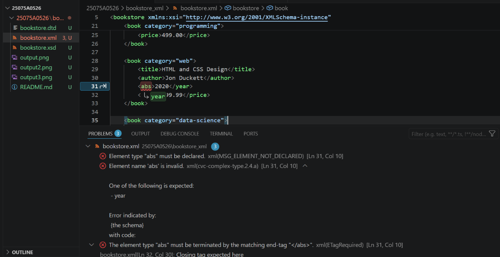
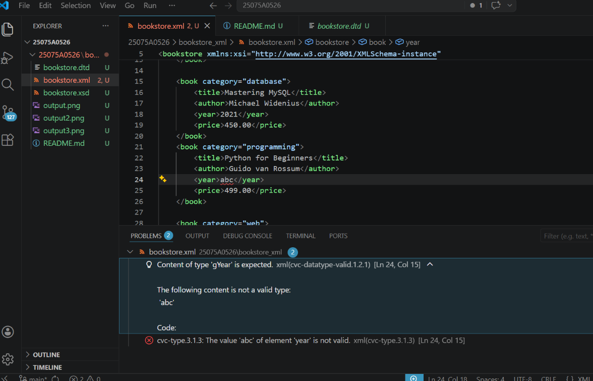

# Bookstore XML Validation using DTD and XSD

## Files
- Bookstore.xml
- Bookstore.xsd
- bookstore.dtd

## Description
This project demonstrates a bookstore XML file validated using both DTD and XSD.

## Output Screenshot

### XML Output

### Validation Output

# Bookstore XML Validation

This project demonstrates XML validation using both DTD and XSD.

## XML Output

## Validation Errors

### Invalid Element Error

### Data Type Error

## Conclusion

The XML file is validated using DTD and XSD.
If the XML structure or data types do not match the schema, validation errors are generated.

